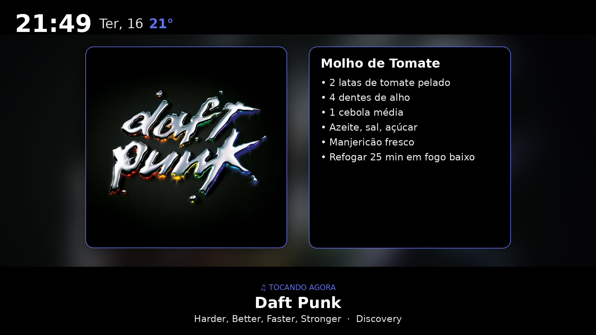
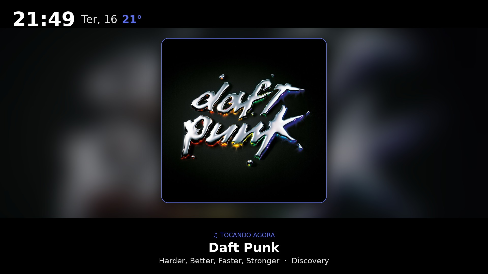
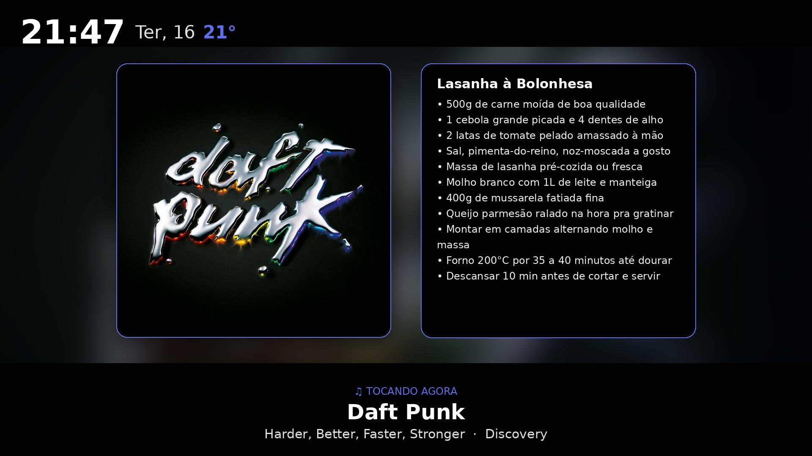

# kitchen-cast

Turn a kitchen TV into an ambient photo frame that **becomes a music + recipe display the moment you play music** — and lets an AI build the cooking playlist for you.

This repository is a **reference implementation**, not a one-click product. It is intentionally written so a strong coding agent can understand the system, replace the home-specific adapters, and port the idea to another Home Assistant + Chromecast setup.

You play music on a speaker. A *different* screen in another room notices, flips from your photo slideshow to the album art of whatever is playing, and (optionally) overlays the recipe you're about to cook. An AI DJ worker, called **Rolo** in my original build, assembles a fitting YouTube Music playlist in the background using the recipe, the requested vibe, and the user's music context. You press play; the food and the music both show up where you're cooking.

No app to open mid-cook. No phone propped against the flour bag. Music is the trigger; everything else follows.



<p align="center">
  
  
</p>

---

## What it actually does

It's a **two-state machine on a Chromecast-connected TV**, plus an optional recipe overlay and an AI playlist step.

```
                          ┌──────────────────────────────────────────────┐
   DEFAULT STATE  ───────▶│  PHOTO SLIDESHOW                              │
   (no music)             │  your photos + clock + 3-day weather          │
                          │  slideshow_gen.py → current.jpg → Chromecast  │
                          └──────────────────────────────────────────────┘
                                        ▲                 │
                  music stops           │                 │  music starts on the speaker
                  (back to photos)      │                 ▼
                          ┌──────────────────────────────────────────────┐
   MUSIC STATE    ───────▶│  NOW PLAYING                                  │
   (speaker active)       │  album art of the current track (full screen) │
                          │  musica_slideshow.py → current.jpg → Chromecast│
                          │                                              │
                          │   + optional RECIPE OVERLAY (right half)      │
                          │     shown only while a recipe is "armed"      │
                          └──────────────────────────────────────────────┘
```

- **Photo slideshow** is what you see almost all the time. It's the base layer.
- **Music mode** takes over automatically when your speaker starts playing, and reverts when it stops. Nothing manual.
- **The recipe overlay** is opt-in: you "arm" a recipe (by chat or via the web app), and it rides on top of music mode for one cooking session, then disarms itself.

## Why this is a little absurd

This is not "a recipe app". It is a small home-lab Rube Goldberg machine that happens to be useful while cooking:

- a Home Assistant box renders JPEG frames with PIL;
- a Chromecast-connected kitchen TV displays one changing `current.jpg`;
- a separate Chromecast Audio acts as the trigger;
- Home Assistant reads live track metadata and starts the music renderer;
- the music renderer pulls album art and redraws the TV frame;
- a recipe website condenses and arms a TV-optimized recipe overlay;
- a headless AI DJ worker ("Rolo" in the original build) creates a YouTube Music playlist from the selected recipe, requested vibe, and available listening context;
- the recipe disarms itself after the session;
- the TV falls back to family photos when the music stops.

The important part is that the chaos is intentionally split into small contracts. A strong coding agent can port the system by replacing adapters, not by reverse-engineering one giant ball of automation spaghetti.

## The pieces

| Piece | Role | Where it runs |
|---|---|---|
| `slideshow/slideshow_gen.py` | Photo slideshow renderer (PIL): photo + clock + weather | Home Assistant (Chromecast host) |
| `slideshow/musica_slideshow.py` | Music-mode renderer: album art + optional recipe overlay | Home Assistant |
| `slideshow/start_musica_helper.py` | Launches the music renderer with current track metadata | Home Assistant |
| `homeassistant/*.yaml` | The state machine: triggers on the speaker, casts the image, arms/disarms recipes | Home Assistant config |
| `app/` | **Web app**: pick a recipe, set a vibe, arm it + get a playlist | any Docker host |
| AI DJ worker / `Rolo` | Headless LLM that curates the YouTube Music playlist | any Docker host |

## Repository map

| Path | What is in it |
|---|---|
| `app/` | FastAPI web app for recipes, playlist jobs, quick playlist shortcuts, and `/api/pending_recipe` |
| `homeassistant/` | Sanitized YAML snippets for shell commands, command-line sensors, timers, booleans, and automations |
| `slideshow/` | Photo renderer, music renderer, and music helper scripts |
| `docs/AI_PORTING_GUIDE.md` | Step-by-step guide for another AI/coder to adapt the build |
| `docs/SYSTEM_CONTRACTS.md` | File formats, routes, entity placeholders, timing invariants, and security boundaries |
| `docs/ARCHITECTURE.md` | Full data flow and implementation gotchas |
| `preview/` | Real/generated preview frames used to judge TV layout |
| `design/` | Extracted UI components and visual tokens from the recipe web app |
| `examples/` | Small portable examples, including an active recipe JSON |

## If you're using an AI to port this

This is the recommended way to reuse the project. Do not start by manually copying YAML line by line. Clone the repo, point a strong coding agent at it, and ask it to adapt the reference build to your Home Assistant entities, Chromecast targets, Docker host, recipe folder, and music provider.

Use a capable model with long-context code understanding, such as Claude Opus or another advanced coding model. A weak model will likely miss the timing contracts and "one image file, two renderers" design, then create a pile of broken automations. Congratulations, that's how you invent suffering.

Start here:

1. [`docs/AI_PORTING_GUIDE.md`](docs/AI_PORTING_GUIDE.md) — the task brief for an AI agent.
2. [`docs/SYSTEM_CONTRACTS.md`](docs/SYSTEM_CONTRACTS.md) — file formats, service contracts, entity placeholders, and invariants.
3. [`docs/ARCHITECTURE.md`](docs/ARCHITECTURE.md) — the full data flow and Chromecast gotchas.
4. `homeassistant/*.yaml` — sanitized snippets to adapt.
5. `app/docker-compose.example.yml` — web app runtime shape.

The most important rule: **do not redesign the system first**. Port the adapters around the existing contracts:

- One displayed image: `/config/www/current.jpg`
- One music metadata file: `/config/.music_state.txt`
- One active recipe file: `/config/music_recipe.json`
- One TV display target: a Chromecast-capable `media_player`
- One music trigger target: a different `media_player`

## How a cook works (the web app)

1. Open the site, tap a recipe.
2. Type a vibe for the playlist (or leave blank), **or** tap one of 5 random existing playlists for instant music.
3. The app condenses the recipe for TV, **arms it** (writes the recipe overlay, starts a 30-minute window), and asks Rolo/the AI DJ worker to build a playlist.
4. You get a link to the ready playlist. You press play on your speaker.
5. Music mode kicks in → album art + your recipe on the kitchen TV. When you're done, it disarms and goes back to photos.

The AI DJ step is intentionally replaceable. In the original setup, Rolo is a headless LLM worker with access to YouTube Music tools. It searches tracks, uses recommendations, creates a playlist, adds songs, and returns a `music.youtube.com/playlist?...` URL. If you use Spotify, Jellyfin, Navidrome, local MPD, or anything else, replace that worker contract instead of touching the Home Assistant display state machine.

## Why it's built this way

- **Music is the only trigger.** No new habit to learn — you already play music when you cook.
- **The renderer never changes for the front-end.** Arming a recipe just writes one JSON file the renderer reads each frame. Chat, web app, or a future button all do the same thing.
- **No secrets in the web-facing app.** It never holds an SSH key to the Chromecast host; Home Assistant *pulls* the recipe over HTTP (`shell_command` + `curl`). The app only carries a Home Assistant REST token.
- **Playlist curation is the only "AI" step**, and it's delegated to Rolo/a headless LLM worker — everything else is deterministic.

## Setup (high level)

1. **Home Assistant** with a Chromecast (or Chromecast Audio as the trigger speaker + a Chromecast on the TV). Drop the `slideshow/` scripts in `/config`, add the `homeassistant/` snippets, set your speaker/TV entity ids and weather coordinates (`WEATHER_LAT`/`WEATHER_LON`).
2. **Recipes**: one `.txt` per recipe in a folder (ingredient/step lines).
3. **AI worker**: a container with a headless LLM CLI + a YouTube Music tool that can create playlists.
4. **Web app**: `app/` — copy `docker-compose.example.yml`, fill the volume paths and `HASS_TOKEN`, `docker compose up -d --build`.

See [`docs/ARCHITECTURE.md`](docs/ARCHITECTURE.md) for the full data flow and the gotchas (there are a few good ones).

## Status

Personal lab project, built incrementally and developed over time. The repository is meant to be readable, adaptable, and honest about the hard parts. It is not maintained as a generic installer.

The repo includes screenshots and design artifacts because this project makes more sense when you can see the kitchen TV, not just read YAML and pretend that is emotionally healthy.
